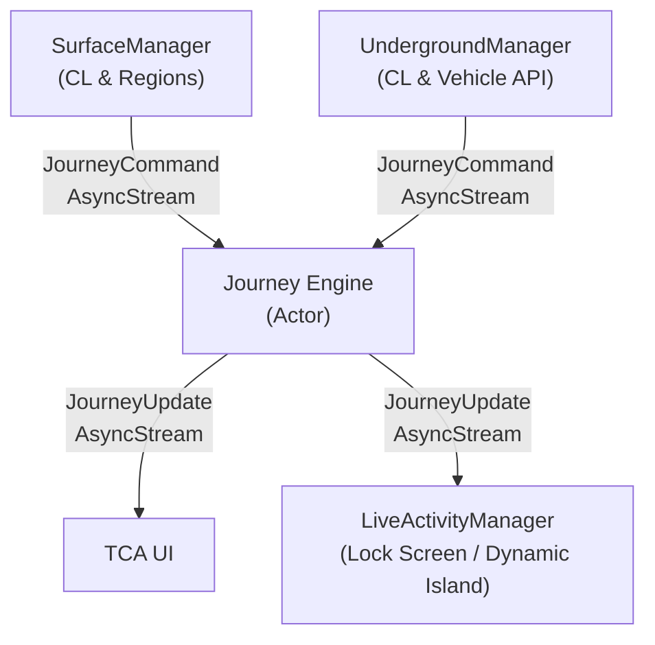

# T Routes
A serverless iOS app to track journeys along the T

## About The Project

T Routes lets a user create a custom route using any of the MBTA's modes of transport, including transfers to different lines as part of the route.

The state of a user's journey is what is reflected on the Live Activities and in-app banner, and it is set by the Journey Engine.
The Journey Engine is an actor that receives tracking update events and determines what to do with them. It has two different monitoring modes.
- **Surface Monitoring:** When a user is at an above ground stop, tracking is done via Core Location. `CLRegion`s are set around stops to increase monitoring frequency as user approaches in order to conserve battery
- **Underground Monitoring:** When a user is underground, Core Location becomes less reliable, so the MBTA's API is needed to assist. Vehicle Position is used to determined where the user is, with Core Location being used to ensure we aren't tracking the wrong vehicle

### Built With

* The Composable Architecture (TCA)
* Swift 6
* SwiftUI
* Core Location (User location tracking)
* ActivityKit (Live Activities)
* SwiftData (Storage of user routes and downloaded GTFS data)

## Technical Highlights

- **Journey Engine Streaming:** When a journey is active, Journey Engine receives new commands via `AsyncStream` from either the Surface or Underground Manager, depending on which mode the state determines it needs. When it receives a new event, it validates it, mutates `JourneyState` based on what needs to happen, saves `JourneyState` to User Defaults, and then runs any effects that the command creates. When `JourneyState` is saved, the TCA UI and Live Activities are updated via `AsyncStream` subscribed to the Journey Engine.
- **Serverless Setup:** T Routes is fully serverless in order to eliminate server costs and keep the app completely free. All GTFS data is stored locally in SwiftData when the user downloads the app. Since the app needs to track user position during a journey, we are able to keep the app alive in the background during tracking. This allows `JourneyState` to be updated seamlessly at all times during a journey, and for the Live Activities to remain accurate even with a locked phone.
- **Rate Limit Queue:** The MBTA's API allows for 20 requests per minute without an API key, and the Rate Limit Queue is used to ensure we do not go over that limit. Requests are prioritized based on their type, and will be delayed or droppped entirely if the queue is reaching or is over that limit. This was a necessary choice, as while a custom MBTA API key is free (coming soon!), requiring users to get one before using the app would be bad design.
- **Position Reconcilation:** If the app is terminated while a journey is active, we attempt to restore or update their position on the journey if possible. We pull the last known `JourneyState` out of User Defaults, and compare it with their current position to resume the journey. If they're too far or too much time has passed, we kill the journey and stop the Journey Engine.
- **Monitoring Switch Handoff:** When the Journey Engine detects that the next stop crosses a surface/underground boundary, it emits an effect to switch monitoring. The engine tears down the active manager and spins up the other. Both managers feed JourneyCommand events through their own AsyncStream, but the engine's Journey Command Validator processes them identically regardless of source. This means the handoff is invisible to the rest of the system, so state mutation, effect processing, and UI updates don't need to know or care which manager is currently active.

### Journey Design

