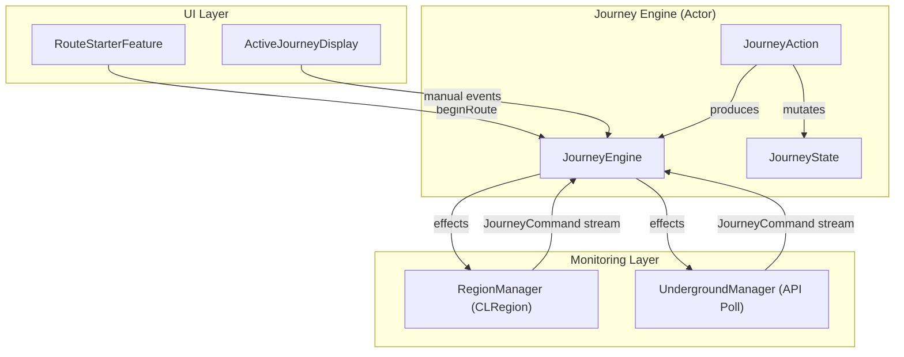
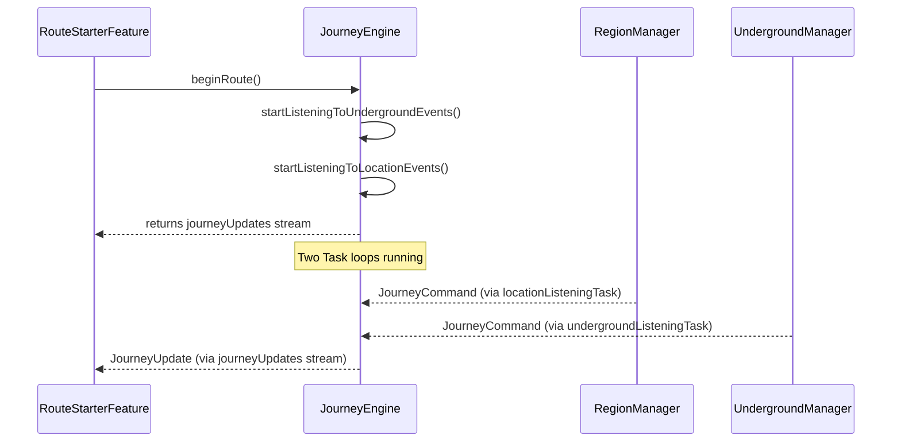

# MBTAFlow Underground Monitoring — Gap Analysis & Solutions

## Current Architecture Summary

The system has three key layers that manage a journey:



**What works:**
- `RegionManager` — confirmed working, yields `executeEntry`/`executeExit` via `CLCircularRegion` monitoring
- `JourneyState` correctly reads `monitoringMode` from station data (underground/aboveground tagged in `stations.json`)
- `JourneyAction` produces `switchMonitoringMode` effects when crossing underground↔surface boundaries
- `JourneyEngine.switchMonitoringMode()` stops one manager and starts the other
- `UndergroundManager` correctly polls vehicle API, tracks boarding phase vs. tracking phase, detects `stopped_at` transitions
- `MatchedLegPath` / `ApiMatcher` correctly maps vehicle API stop IDs → leg stops via platform/station/parent lookups

---

## Deficiency 1: No Way to Set Stop When Starting at an Underground Stop

### The Problem

When a route starts at an underground stop, `beginRoute()` calls:

```swift
// JourneyEngine.swift L104-118
func beginRoute(route: ResolvedUserRoute) async -> AsyncStream<JourneyUpdate> {
    let journey = JourneyState(route: route)
    saveActiveJourneyAndPublish(journey)
    if let firstStop = journey.currentStop {
        await startListeningToUndergroundEvents()
        await startListeningToLocationEvents()
        await monitorNextStop(stop: firstStop)
        await self.fetchPredictions(for: firstStop)
    }
    return journeyUpdates
}
```

`monitorNextStop` sees `mode == .underground` and calls `prepareTrackedVehicleForUndergroundMonitoring`, which fetches predictions and selects a vehicle. Then `setTrackedVehicle` is called with `waitToBoard: true` (because the stop's role is `.boarding`).

**The gap:** The `UndergroundManager` enters `waitingToBoard` phase, but it can only detect that the vehicle has *departed* the boarding stop — it cannot tell us the user has *arrived at* that stop. The first stop never gets an `executeEntry` event, so the journey is stuck at `movementStatus: .enRoute` for the boarding stop.

For surface stops, `RegionManager.registerRegion` solves this via `didDetermineState(.inside)` — if you're already inside the region when it's registered, you immediately get an entry event. Underground has no equivalent.

### Proposed Solution: Use `startUpdatingLocation` for Initial Stop Detection

The `UndergroundManager` already calls `startUpdatingLocation()` in [startSession()](file:///Users/adampost/Desktop/MBTAFlow/MBTAFlow/TRoutes/Underground/UndergroundManager.swift#L84-L96) but the `didUpdateLocations` delegate method is empty (L295-297).

**Approach:**

1. **Add a proximity check in `didUpdateLocations`**: When in `waitingToBoard` phase, use the incoming GPS coordinates to calculate distance to the boarding stop. If within a threshold (e.g., 150m), yield `executeEntry` for the boarding stop.

2. **Store the boarding stop's coordinates** in `UndergroundManager` when `setTrackedVehicle` is called (you already have `boardingStopId` — you just need lat/lon).

3. **Guard against duplicate firing**: Set a flag like `hasYieldedInitialEntry` so this only fires once per boarding stop.

```swift
// Proposed additions to UndergroundManager

private var boardingStopCoordinate: CLLocationCoordinate2D?
private var hasYieldedInitialEntry = false

func setTrackedVehicle(
    vehicleId: String, tripId: String, boardingStopId: String,
    waitToBoard: Bool,
    boardingStopLat: Double, boardingStopLon: Double  // NEW params
) async {
    // ... existing code ...
    boardingStopCoordinate = CLLocationCoordinate2D(
        latitude: boardingStopLat, longitude: boardingStopLon
    )
    hasYieldedInitialEntry = false
    // ... existing code ...
}

func locationManager(_ manager: CLLocationManager, didUpdateLocations locations: [CLLocation]) {
    guard phase == .waitingToBoard,
          !hasYieldedInitialEntry,
          let boardingCoord = boardingStopCoordinate,
          let userLocation = locations.last else { return }

    let stopLocation = CLLocation(latitude: boardingCoord.latitude, longitude: boardingCoord.longitude)
    let distance = userLocation.distance(from: stopLocation)

    if distance < 150 {  // meters
        hasYieldedInitialEntry = true
        if let stopId = currentStopToMonitorId {
            continuation?.yield(.executeEntry(stopId: stopId))
        }
    }
}
```

> [!TIP]
> The `ResolvedStop` already carries `latitude` and `longitude` — thread those through from `monitorNextStop` → `setTrackedVehicle`.

**Why this works for the first stop:** The user opens the app at an underground station. `startUpdatingLocation` gives a GPS fix (even underground, the phone often has a recent cached location or can get one at the station entrance). The proximity check fires `executeEntry`, transitioning the journey to `atStop` so predictions display and the boarding flow begins.

---

## Deficiency 2: No Way to Reset Stop in UG Mode If User Doesn't Board

### The Problem

When the user arrives at an underground boarding stop and sees predictions, the `UndergroundManager` enters `waitingToBoard` phase for a specific tracked vehicle. If that vehicle departs and the user didn't board:

1. `evaluateBoardingProgress()` detects the vehicle departed and yields `executeExit` — advancing the journey to the next stop
2. But the user is still standing on the platform, didn't board, and now the journey state is wrong
3. There is no mechanism to say "I'm still at this stop, re-select the next vehicle"

### Proposed Solution: JourneyState Backtracking + Re-selection

This needs two pieces:

**A. Add a `backtrackToPreviousStop()` method to `JourneyState`:**

```swift
// JourneyState.swift

/// Reverts the last advanceToNextStop(). Returns the stop we backtracked to, or nil if at start.
mutating func backtrackToPreviousStop() -> ResolvedStop? {
    let prevIndex = stopIndex - 1
    guard stopOrder.indices.contains(prevIndex) else { return nil }

    stopIndex = prevIndex
    let prevStop = stopOrder[prevIndex]
    monitoringMode = prevStop.monitoringMode

    if legOrder.indices.contains(prevStop.legIndex) {
        legIndex = prevStop.legIndex
    }

    return prevStop
}
```

**B. Add a `missedTrain` JourneyAction + corresponding ManualEvent:**

```swift
// JourneyAction.swift
enum JourneyAction: Equatable {
    case arriveAtStop
    case departFromStop
    case missedVehicle    // NEW
}

// In the reduce method:
case .missedVehicle:
    return missedVehicle(state: &state)

private func missedVehicle(state: inout JourneyState) -> [JourneyEffect] {
    // If we've been auto-advanced past a boarding stop, go back to it
    guard let previousStop = state.backtrackToPreviousStop() else { return [] }
    state.movementStatus = .atStop
    state.predictionState = .loading(stopId: previousStop.mbtaStopId)
    return [
        .fetchPredictions(previousStop),     // get fresh predictions / new vehicle
        .monitorStop(previousStop),          // re-register for this stop
        .sendNotification("Re-selecting vehicle at \(previousStop.stopName)")
    ]
}
```

**C. Expose in the UI via JourneyClient + ActiveJourneyDisplay:**

```swift
// JourneyClient.swift
var missedTrain: @Sendable () async -> Void

// ManualEvent
enum ManualEvent: Equatable {
    case nextStopTapped
    case atStopTapped
    case missedTrainTapped   // NEW
}
```

**D. Alternatively / additionally — use `startUpdatingLocation` as an automatic guard:**

If the `UndergroundManager` detects the vehicle departed but `didUpdateLocations` still shows the user within 150m of the boarding stop, the manager can **suppress** the `executeExit` and instead trigger re-selection automatically:

```swift
// In evaluateBoardingProgress():
private func evaluateBoardingProgress() {
    let hasDeparted = vehicleHasDepartedStop()
    guard hasDeparted else { return }

    // NEW: Check if user is still near the boarding stop
    if isUserNearBoardingStop() {
        // User didn't board — re-select next vehicle
        phase = .waitingToBoard
        resetVehiclePositionTracking()
        Task { await refetchAndTrackNextVehicle() }
        return
    }

    phase = .trackingVehicle
    if let currentStopToMonitorId {
        continuation?.yield(.executeExit(stopId: currentStopToMonitorId))
    }
}
```

> [!IMPORTANT]
> You should implement **both** the manual button (missedTrain) and the automatic GPS guard. The GPS guard handles the happy path silently. The manual button is the fallback for when GPS is too imprecise underground.

---

## Deficiency 3: Stream Execution Concerns

### Current Stream Architecture



### Identified Issues

#### Issue 3a: Both streams start simultaneously, both persist indefinitely

In [beginRoute()](file:///Users/adampost/Desktop/MBTAFlow/MBTAFlow/TRoutes/JourneyEngine/JourneyEngine.swift#L104-L118), both listeners start regardless of the initial monitoring mode:

```swift
await startListeningToUndergroundEvents()  // always
await startListeningToLocationEvents()     // always
```

**This is actually fine for listening** — both streams can coexist because `journeyCommandValidator` already gates entry/exit commands against the current state. However, it's wasteful and could cause confusion if both yield commands for the same stop.

**Recommendation:** Start only the stream matching the initial `monitoringMode`:

```swift
if journey.monitoringMode == .underground {
    await startListeningToUndergroundEvents()
} else {
    await startListeningToLocationEvents()
}
```

But keep both stream *tasks* alive through the full journey (just don't actively monitor in both). This is because `switchMonitoringMode` needs both streams' continuations to be valid.

#### Issue 3b: `switchMonitoringMode` doesn't start the new stream listener

In [switchMonitoringMode()](file:///Users/adampost/Desktop/MBTAFlow/MBTAFlow/TRoutes/JourneyEngine/JourneyEngine.swift#L198-L218):

```swift
case .surface:
    await UndergroundManager.shared.stopSession()
    // ← Missing: await startListeningToLocationEvents() 
    //            + RegionManager.shared.registerRegion(...)
    break
case .underground:
    await RegionManager.shared.stopAll()
    // ← Missing: await startListeningToUndergroundEvents()
    //            + startSession()
    break
```

**The stop/start of the monitoring manager is missing.** The method stops the old manager but doesn't ensure the new one's stream is active. The actual `registerRegion` or `setTrackedVehicle` call happens later in `monitorNextStop`, but:

- For **underground → surface**: `RegionManager` stream may not be created yet if it was never started (because `beginRoute` started underground). You need `startListeningToLocationEvents()` here.
- For **surface → underground**: `UndergroundManager` stream may not be created yet. You need `startListeningToUndergroundEvents()` here, and `startSession()` to begin `startUpdatingLocation`.

**Fix:**

```swift
func switchMonitoringMode(newMode: MonitoringMode) async {
    guard var currentJourney = userDefaultsClient.loadActiveJourney() else { return }
    currentJourney.monitoringMode = newMode

    switch newMode {
    case .surface:
        await UndergroundManager.shared.stopSession()
        await startListeningToLocationEvents()  // ensure stream exists
    case .underground:
        await RegionManager.shared.stopAll()
        await startListeningToUndergroundEvents()  // ensure stream exists
        UndergroundManager.shared.startSession()   // begin startUpdatingLocation
    }

    saveActiveJourneyAndPublish(currentJourney)
}
```

#### Issue 3c: `startSession()` is never called

`UndergroundManager.startSession()` (which calls `startUpdatingLocation`) is **never invoked** from `JourneyEngine`. The only entry point is `setTrackedVehicle`, which calls `fetchVehicleData()` and sets the timer — but `startUpdatingLocation` requires `startSession()`.

Without `startUpdatingLocation`, the app **will be suspended by iOS** in the background within ~10 seconds. The API poll timer will not fire.

> [!CAUTION]
> This is the most critical bug. Without `startUpdatingLocation()` keeping the app alive, the underground polling timer will stop firing in the background. The journey will appear to freeze once the screen locks.

**Fix:** Call `startSession()` before or immediately after `setTrackedVehicle()`:

```swift
// In monitorNextStop(), underground case:
case .underground:
    UndergroundManager.shared.startSession()  // ADD THIS — keeps app alive
    if await prepareTrackedVehicleForUndergroundMonitoring(stop: stop, journey: currentJourney),
       let trackedVehicleId, let trackedTripId {
        await UndergroundManager.shared.setTrackedVehicle(...)
    }
```

Or call it from within `setTrackedVehicle` itself, but calling it in `monitorNextStop` is cleaner because `startSession` is a session-level concern.

#### Issue 3d: `undergroundListeningTask` is never set to nil on stream finish

The cleanup handler in [startListeningToUndergroundEvents()](file:///Users/adampost/Desktop/MBTAFlow/MBTAFlow/TRoutes/JourneyEngine/JourneyEngine.swift#L80-L92) calls `locationEventStreamDidFinish()` which only clears `locationListeningTask`, not `undergroundListeningTask`:

```swift
undergroundListeningTask = Task {
    for await event in stream { ... }
    self.locationEventStreamDidFinish()  // ← wrong cleanup
}
```

**Fix:** Add a separate cleanup:

```swift
private func undergroundEventStreamDidFinish() {
    undergroundListeningTask = nil
}
```

#### Issue 3e: Singleton `AsyncStream` can only have one consumer

`JourneyEngine.journeyUpdates` is created once in `init()`. The stream is returned from `beginRoute()`:

```swift
return journeyUpdates  // same stream every call
```

If `beginRoute()` is called a second time (e.g., route cancelled and restarted), the stream that `RouteStarterFeature` is iterating over is the **same object**. Since `AsyncStream` is single-consumer, the old `for await` loop in `RouteStarterFeature.beginRoute` action still holds the iteration. A new call to `beginRoute` would return the same already-consumed stream.

**Risk:** If the user ends a route and starts a new one without restarting the app, the second journey's updates may not be delivered.

**Recommendation:** Create a new stream/continuation pair per `beginRoute()` call:

```swift
func beginRoute(route: ResolvedUserRoute) async -> AsyncStream<JourneyUpdate> {
    let (stream, continuation) = AsyncStream<JourneyUpdate>.makeStream()
    self.journeyUpdateContinuation = continuation
    // ... rest of setup ...
    return stream
}
```

And in `endRoute()`, finish the continuation:

```swift
func endRoute() async {
    journeyUpdateContinuation?.finish()
    journeyUpdateContinuation = nil
    // ... rest of cleanup ...
}
```

---

## Summary Matrix

| Deficiency | Root Cause | Solution | Complexity |
|---|---|---|---|
| **1. Can't set stop at UG start** | No equivalent of `didDetermineState(.inside)` for underground | Use `didUpdateLocations` GPS proximity check in `waitingToBoard` phase | Low-Medium |
| **2. Can't reset if missed train** | No backtrack mechanism; auto-advance is one-way | Add `backtrackToPreviousStop()` + `missedVehicle` action + GPS guard in `evaluateBoardingProgress` | Medium |
| **3a. Both streams start** | `beginRoute` starts both listeners | Gate on initial `monitoringMode` | Low |
| **3b. Switch doesn't start new stream** | `switchMonitoringMode` only stops old manager | Add `startListening*` calls in switch | Low |
| **3c. `startSession` never called** | `startUpdatingLocation` never invoked — app will be killed in background | Call `startSession()` from `monitorNextStop` | **Critical — Low effort** |
| **3d. Wrong cleanup handler** | Underground finish calls location cleanup | Add separate `undergroundEventStreamDidFinish` | Low |
| **3e. Singleton stream** | Single `AsyncStream` can't be re-consumed | Create new stream per `beginRoute()` call | Low |

> [!WARNING]
> **Issue 3c is the highest priority.** Without `startUpdatingLocation()`, iOS will suspend the app in the background and the entire underground polling mechanism stops working. This should be fixed first.
